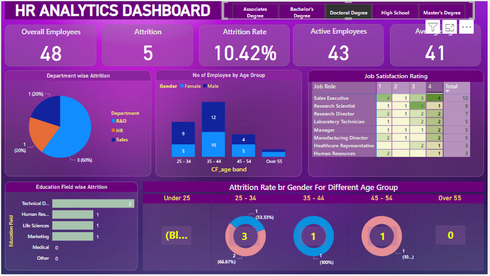
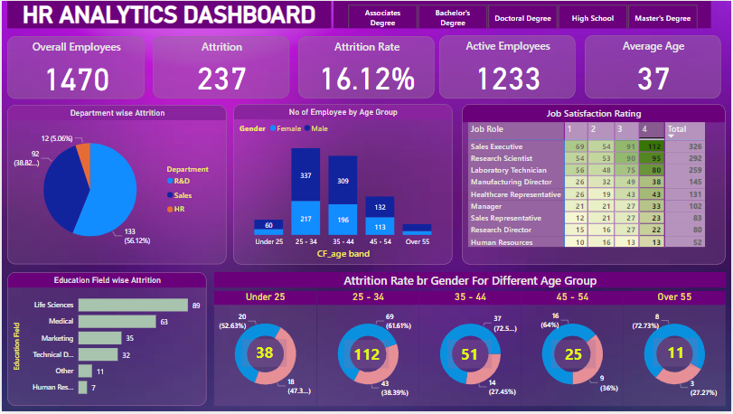

# HR-Analysis

## Introduction 
I came across a data tutorial online and I decided to follow through with the tutorial to improve my skill on data cleaning, analysis and visualization. This is a power BI project on HR Analysis.

## Problem statement.
-	What is the general attrition rate?
-	What is the Job satisfaction rate?
-	What is the attrition rate gender wise for the age different group?
-	What is the number of the overall employees and how many are active?
-	Which education field has the highest attrition rate?

## Data Sourcing
I downloaded the data set via the link in the description of the tutorial 

## Data cleaning 
The data was clean but to be very sure I applied the delete duplicate function in Excel to get rid of duplicate values before loading it to power BI and not duplicate values was found.

## Data Modelling 
Power BI automatically connect related table. But I have just a table so the was no model connection 

## Data Analysis and Visualization

## Conclusions
- There is more male employees.
- Life Sciences has the highest attirtion rate followed by Medical.
- Most of the employees are of the age range of 25 - 34.
- The average age is 37.
  
You can interact with the dashboard 

https://github.com/Ayandayoola/HR-Analysis/blob/main/HR_Analytics.pbix)

Thank you for reading through.

